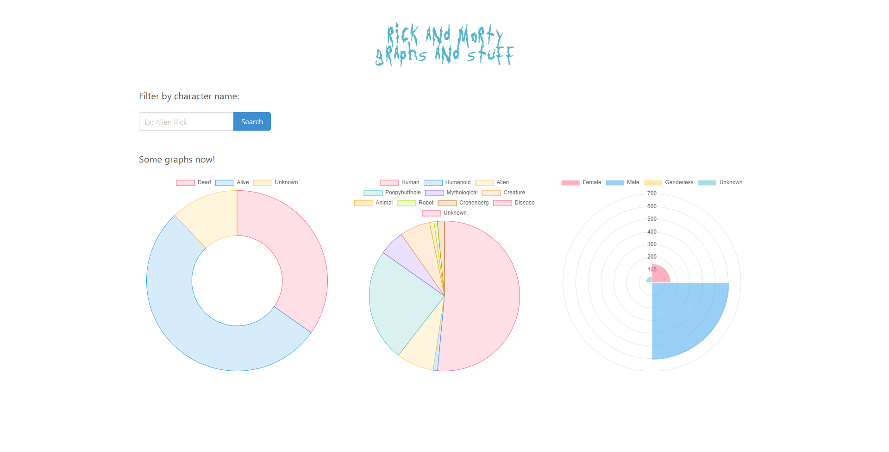
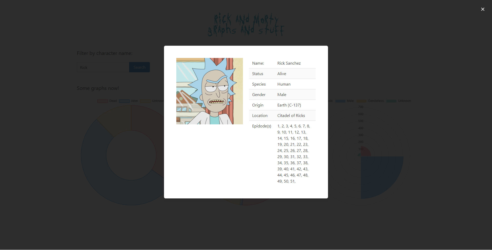

<!-- PROJECT LOGO -->
<!-- markdownlint-disable -->
<div align="center" style="margin-top: 24px">
  
  <h3 align="center">A client application to train React, Bulma and Chart.js</h3>
</div>
<!-- markdownlint-disable -->

<!-- LAYOUT PREVIEW -->
## LAYOUT

### Home



### Details



<!-- GETTING STARTED -->
## Getting Started

This is an example of how you may give instructions on setting up your project locally.

### Installation

1. Clone the repo

   ```shell
   git clone git@github.com:allanfoppa/rick-and-morty-graphs-and-stuff.git
   ```

2. Run a Docker command

   ```shell
   docker-compose up
   ```

## Next steps

- [ ] Improve UX on search caracter button and his content
- [ ] Add more graphs
- [ ] Increase coverage of tests

## Contributing

Any contributions you make are **greatly appreciated**.
